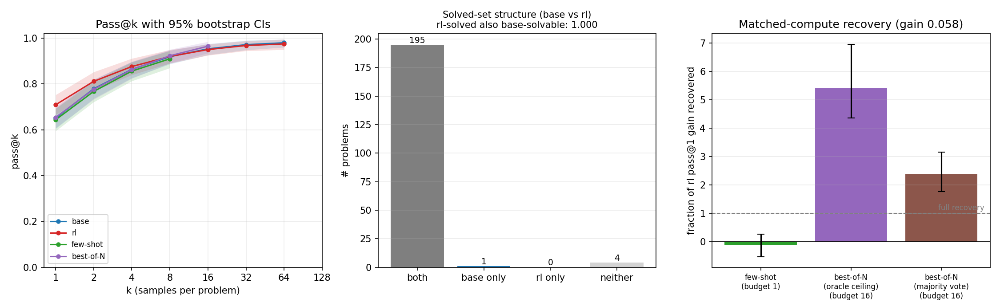

## Abstract

GRPO on GSM8K lifts a small model's held-out pass@1 by 5.8 points, and the paired per-problem confidence interval on that gain (0.0466-0.0695) excludes zero. We ask how much of the gain is new capability and how much was already in the base model, and the data give a split answer: on the slice where our tests have discriminative power, most of it is demonstrably old, and the part we cannot prove old refuses to go away. One scope condition first, because it shapes every claim. The run is rank-16 LoRA under a KL anchor and the policy ends within 0.0082 KL of where it started, a design that biases the outcome toward elicitation-shaped change by construction, so these are claims about KL-anchored low-rank GRPO at 8 GPU-hours, not about RL in general. We run three tests on a held-out GSM8K slice and a harder out-of-distribution MATH slice. The per-problem test: every GSM8K problem the RL model solves, the base model also solves within 64 samples, but base solves 196 of 200, so that test had only 4 problems of discriminative room and its perfect subset fraction is nearly vacuous; on MATH, where the test has power, the fraction is 0.9559, with 6 of 136 rl-solved problems never reached by the base model, a count consistent with its chance expectation under equal rates (2.6991 per direction) and unresolved pending a registered deeper-sampling probe. The aggregate test: no Yue-style pass@k crossover appears on either slice, and on MATH the rl-base gap moves the wrong way for elicitation, 0.0253 at k=1 widening to 0.0333 at k=64, with a paired interval on the k=64 gap (0.0000-0.0667) sitting entirely at or above zero; at 64 samples pass@64 is the solved indicator, so this widening and the rl-only set are the same observation, which we count once. The selection test: majority voting over 16 base-model samples buys back the entire RL gain roughly twice over on GSM8K and several times over on MATH, but that purchase spends sixteen times the inference of the single sample it is compared against, so it measures how cheap test-time compute is, not whether the gain survives equal treatment; under the same vote at the same budget, the RL model stays above base at six of seven GSM8K budgets, three of them with intervals excluding zero, and the two models are statistically indistinguishable at every MATH budget. Few-shot prompting with RL-derived exemplars recovers nothing in distribution (-0.1294, interval -0.5300-0.2685) and is descriptively strong out of distribution, an effect we report without attribution because the arm lacks an exemplar-source control. So: can all the changes be represented as elicitation? Most, demonstrably, where the tests can see. All, no, not at this measurement's resolution. If RL at this scale mostly elicits, base-model evaluations plus cheap elicitation bound most of what RL tuning surfaces; the unexplained residue, small here, is exactly what such bounds would miss, and measuring it is the point.

## Introduction

Train a small language model with reinforcement learning on math problems and it gets better. pass@1 climbs, the benchmark bar moves, and the run looks like learning. The question is what kind. One reading says RL taught the model something, reasoning it could not do before. The other says the ability was sitting in the base model the whole time and RL turned up the probability of sampling it. The benchmark delta is identical in both worlds. The facts about the world are not.

The second reading has a name, elicitation, and the evidence for it is stronger than most people expect. RL-trained models beat their base models at one sample per problem but lose to them when both get hundreds of samples, which suggests the base model could always reach the answers and RL just concentrated probability on them. Random rewards recover most of the RL gain in some model families. A single training example recovers most of it too. The probability shifts RL induces in a small model can be grafted onto a larger one and they still work, and the updates themselves touch a small fraction of the weights. Against this stands evidence from much larger runs. Train for thousands of GPU-hours with KL resets and curricula and models start solving problem families the base model fails at any sampling budget anyone has tried. The honest summary is that the answer looks scale-dependent. At modest compute RL behaves like a sharpener of the base distribution, and somewhere past the compute most practitioners ever spend, it may start to behave like a teacher.

We test the elicitation reading where it should be strongest, a small model trained with GRPO for under 24 GPU-hours, and we test it three ways, in increasing order of strictness. The aggregate test replicates the pass@k crossover on a controlled run where we train the model ourselves on known data rather than analyzing third-party checkpoints. The per-problem test asks whether the RL model's solved set is a subset of what the base model reaches within 64 samples, because aggregate curves can match while hiding genuinely new solutions, and subset structure is what "all changes are elicitation" actually predicts. The selection test asks what fraction of the RL gain you can buy without RL at all, by spending sampling budget on few-shot prompts built from RL-style solutions or on majority-vote best-of-N over the base model, selected without consulting the verifier, and then asks the converse question with the budgets equalized: when both models get the same vote over the same number of samples, does the RL advantage survive?

The stakes are not academic. Capability evaluations are the load-bearing instrument of frontier-model oversight, and they measure what a model does, not what it could do after someone else's RL run. If RL at deployment-relevant scales is elicitation, then evals on base models, plus cheap elicitation effort, bound what RL tuning can surface, and the headroom available to a model that is deliberately underperforming is a measurable quantity. The sandbagging literature already uses RL as an elicitation tool in exactly this sense. If RL expands capability instead, that bound evaporates, and the question of whether RL-trained chains of thought stay faithful enough to monitor gets sharper, because genuinely new behavior has no base-model referent to compare against. Our parallel work on GRPO and chain-of-thought monitorability makes that second world concrete. This paper asks whether the first, more comfortable world is the one we are actually in, at least at small scale.

We find a split verdict, and we think the split is the result. The RL gain is real on both slices; the paired per-problem intervals exclude zero. Most of it is demonstrably old capability on MATH, the slice where the per-problem test has power: the solved sets nest at 0.9559, and label-free selection on the base model buys more absolute accuracy than RL training added; GSM8K agrees in direction but its ceiling leaves the test no room to disagree. But the strict universal, every change representable as elicitation, does not survive this run's own data. Under the same voting treatment at the same budget the RL model keeps a small edge at nearly every in-distribution budget. The out-of-distribution pass@k gap widens with k instead of closing. And six MATH problems remain that the RL model solves and the base model never reached in 64 draws. Most, demonstrably; all, no, not at this measurement's resolution.

## What elicitation would mean

The debate needs operational terms before any experiment can decide it. We use three, in increasing order of strictness, each pre-registered in the run's intake. Elicitation at the aggregate level means the base model's pass@k catches the RL model's as k grows, because RL bought its single-sample gain by concentrating probability mass on solutions the base model could already reach. Elicitation at the problem level means the set of problems the RL model solves nests inside the set the base model reaches at feasible k, because aggregate curves can match while hiding individual problems only the RL model can do. Elicitation in the operational sense, the one a deployed evaluation could actually use, means the RL gain is recoverable on the base model at inference time without weight updates and without labels, and the recovered fraction is a number a skeptic can argue with. Expansion is the negation of the second or third: problems the base model cannot reach at any feasible budget, or a gain no inference-time intervention buys back.

Two caveats apply to everything below and we state them once, up front, because they are scope conditions rather than footnotes. First, the regime. The elicitation evidence in the literature comes overwhelmingly from standard-scale runs, hours to tens of GPU-hours, and the expansion evidence from prolonged ones, thousands of GPU-hours with curricula and reference-policy resets [@liu2025prorl; @sun2025rlgrokking]. Our run is deliberately at the small end, 8 GPU-hours of training inside a 24 GPU-hour ceiling. Second, the parameterization. Rank-16 LoRA constrains updates to a low-rank subspace, and a KL coefficient of 0.04 holds the policy near its origin; the final policy sits within 0.0082 KL of the base model. A run constrained to barely move in distribution space is biased toward elicitation-shaped change by construction, so a clean elicitation verdict here would not bound unconstrained RL, and the deviations from elicitation that we do find below are the more notable for having survived a design tilted against producing them. An unanchored same-compute ablation is registered as a follow-up; until it runs, every claim in this paper is a claim about KL-anchored low-rank GRPO at small scale.

## Methods

### Model and task

We train Qwen2.5-1.5B-Instruct [@qwen2024qwen25] . The design preferred the 1.5B model over the 3B, and a smoke run showed it trains cleanly under our GRPO harness, so no escalation was needed . The small end of the model family is the point rather than a concession. The elicitation hypothesis we test is explicitly scoped to small models at modest compute, and a 1.5B model is where the existing elicitation evidence should bind most tightly if it binds at all. One property of this choice matters for interpreting everything downstream. The base model already solves roughly 75 percent of GSM8K training problems with a single sample at temperature 1.0 , which caps the available RL lift near 25 points and means many GRPO groups are all-correct and carry no gradient . The intake-registered kill criterion, a minimum 5-point pass@1 lift on the held-out slice, arbitrates whether the question stays live despite that thinner signal .

The task is GSM8K [@cobbe2021gsm8k] (HuggingFace dataset openai/gsm8k, config "main"), grade-school math with verifiable numeric answers . The training reward is outcome-only. A completion earns 1.0 for an exact match on the normalized final number, 0.1 if a number parses but is wrong, and 0.0 if no answer parses, the same shaping as the parent harness . Normalization strips commas and dollar signs and renders integers without a decimal point .

### Data and splits

The training pool is the full GSM8K train split of 7,473 problems, shuffled with seed 42 . The held-out evaluation slice is 200 problems, the first 200 after a seed-42 shuffle of the 1,319-problem GSM8K test split . The slice is held out by construction, since training never touches the test split . It is frozen on disk as results/real/eval_slice.csv, where each problem carries the id "test-i" with i its row index in the original test split, alongside the question text and the normalized gold answer . The one place leakage could re-enter is the few-shot elicitation arm, whose exemplars are therefore restricted to problems from training-distribution pools, never the eval slices, with the selected exemplars and their provenance recorded in auditable exemplars files. The GSM8K procedure is deterministic: greedy-decode the RL checkpoint over the first 64 problems of the seed-42 shuffled training pool, in the training data's own order, and keep the first 4 problems it solves, with the RL model's own completions as the exemplar solutions . The MATH procedure is the same selection rule over the seed-42 shuffled MATH train split (EleutherAI/hendrycks_math, all seven subjects, problems with a parseable boxed gold), with the RL checkpoint again generating the exemplar solutions; the exemplars file records the problem ids, the generating checkpoint, the scan size, and the git commit for audit, and the eval slice is drawn from the MATH test split, so train-pool exemplars cannot leak into it by construction .

Because the base model's high GSM8K competence pushes both base and rl arms toward the slice ceiling at large k, a second, harder slice guards the crossover and subset tests against saturation: a 200-problem level-stratified slice of MATH-500, the 500-problem representative test subset [@lightman2023verify] of MATH [@hendrycks2021math], frozen at results/real/eval_slice_math.csv with its own provenance sidecar; the run evaluated its first 150 rows after the budget trim disclosed below, a mix that keeps 56 percent of problems at difficulty levels 3 through 5 . Its answers are graded by boxed-answer extraction under the standard MATH normalization with a numeric fallback, a strict equivalence applied identically to every arm . GRPO trains on GSM8K only, so the MATH slice additionally measures whether the RL reweighting transfers to harder, out-of-distribution math. Both slices live in the same data directory under the same schema, feed one combined analysis summary, and sit behind the same reproducibility gate .

### GRPO training

We run GRPO [@shao2024deepseekmath] through trl 1.5.1 with transformers 4.57.6, peft 0.19.1, datasets 3.6.0, and torch 2.12.0+cu130, on a single RTX 5090 . The policy is updated through LoRA adapters [@hu2021lora] of rank 16 and alpha 32 on all attention and MLP projections, in bf16 with gradient checkpointing, generating with the HF backend . Training runs 1,900 optimizer steps with a checkpoint every 100 steps, plus a pre-RL anchor checkpoint of the untouched base policy . Each step draws 8 generations per prompt at a per-device batch of 8 with gradient accumulation 4, so one step consumes 32 completions over 4 unique prompts, and 1,900 steps visit about 7,600 prompts, almost exactly one epoch over the training pool . The learning rate is 1e-5, sampling temperature 1.0, and completions are capped at 640 tokens, comfortably above the 200 to 320 tokens we observe in practice, with an effectively zero clipped-completion rate in the smoke run .

The KL coefficient is 0.04 against the base policy . The parent harness used no KL anchor for its short smoke, but over a 1,900-step run the anchor prevents distribution collapse, and staying near the base distribution is precisely the regime the elicitation hypothesis concerns; the scope-condition consequences of this choice are stated up front in the previous section . The seed is 42 throughout, covering the training shuffle, the GRPO config, and the eval slice selection . The harness is a GSM8K adaptation of our existing GRPO and LoRA stack, frozen at commit 88ba769 . A 12-step smoke run gated the launch, showing live and non-degenerate reward (per-step means 0.55 to 0.94), KL near 3e-4, and 23.2 of 32.6 GB VRAM in use . Projected wall-clock is 8.0 to 8.5 hours at the smoke's 15.2 to 16 seconds per step . The run completed all 1,900 steps in 28,910 seconds, 8.03 hours against the 8.0 to 8.5 hour estimate, leaving 21 checkpoints on disk . Train-time single-sample reward rose from a first-50-step mean of 0.7549 to a last-50-step mean of 0.8147, and the KL to the base policy stayed small throughout, last-50 mean 0.0043 with a maximum of 0.0082, so the policy ended close to where it started in distribution space . The rl arm evaluates checkpoint-final; a pre-grid sanity check verified that checkpoint-0, the pre-RL anchor, reproduces the base model exactly on 20 greedy completions .

### The four evaluation arms

The evaluation emits one row per problem, arm, and sample into a single per-example file, with exactly four arms named base, rl, elicit_fewshot, and elicit_bon . The base arm samples the untouched base model and the rl arm samples the final GRPO checkpoint under identical decoding, each at 64 samples per problem . The design planned k up to 128; measured throughput at the real operating point (about 1,500 tokens per second on the GSM8K arms and 909 on the longer MATH completions, mean completions of 247 and 565 tokens respectively) priced the full grid at roughly twelve GPU-hours against a six-hour eval budget, so the pre-registered trim ladder bounded base and rl at k=64 and the MATH slice at its first 150 problems . Every pass@k claim in this paper is therefore bounded at k=64. The few-shot arm pays an additional cost outside the unit: its exemplar prompt adds roughly 1.4 thousand prefill tokens per call, which slows that arm well below the plain-arm rates and is part of why budgets are priced in completions rather than wall-clock . The elicit_fewshot arm samples the base model behind a few-shot prompt whose exemplars are training-pool problems, with a headline budget of one sample per problem . The elicit_bon arm samples the base model 16 times per problem and selects one answer without consulting the ground truth, by self-consistency majority voting over the normalized final answers [@wang2022selfconsistency], with ties broken toward the earliest first occurrence and unparseable answers excluded from the vote . All four arms decode identically at temperature 0.6 and top-p 0.95, following the sampling convention of Yue et al. [@yue2025does], with completions capped at 640 tokens on GSM8K and 1024 on MATH, and the prompt is the training harness's own chat template so the rl arm is evaluated in the format it was trained in . The decoding parameters are recorded in the samples.csv.md sidecar at generation time .

The budget accounting prices budgets in generated completions per problem, the unit the pass@k literature uses, with two disclosed deviations from a strict FLOPs match: the few-shot prompt adds roughly 1.4 thousand prompt tokens per call, and selection at budget N spends N times the inference compute of rl pass@1 . That second deviation is not a footnote, it is the structure of the recovery test: the recovered fraction divides what a B-sample intervention on the base model buys by the single-sample RL gain, so it answers "what can you buy without RL", a deliberately budget-asymmetric question, and we label it as such wherever it appears. The equal-treatment question gets its own instrument, added in revision after an adversarial review panel: the matched-budget table applies the same deterministic prefix majority vote to both the base and rl arms' samples at the same budget, for every shared power-of-two budget from 1 to 64 (at budget 1 this reduces to a single-draw comparison, not a vote), with a paired bootstrap interval on each per-budget difference, computed inside the same reproducibility gate as every other number . One estimator note for that table: the elicit_bon arm draws 16 fresh samples while the matched-budget vote runs over prefixes of the base arm's own 64, and the two constructions give estimates of voted-base-at-16 that differ by ordinary sampling variation, 0.7900 against 0.8100 on GSM8K; matched-budget comparisons therefore standardize on the prefix construction for both arms, and we never compare across the two constructions .

Recovery is computed as a paired comparison on the problems common to all four arms, at sample budgets running over powers of two up to the largest budget every common problem supports, which after the trim is 64 for the plain arms . Success at budget one is the mean over problems of the unbiased pass@1 estimate; with a single sample there is nothing to select. Success at budgets of two and above scores the single selected answer: the majority vote over the normalized answers of the first B samples, with ties broken toward the earliest first occurrence and unparseable answers excluded . The summary reports both selector semantics side by side, because they answer different questions. The oracle line (recovered_fraction) selects with the ground-truth verifier, which makes success-at-B definitionally pass@B: it measures whether correct answers are present in the base model's samples, the reachability ceiling, and is not a deployable elicitation claim since no deployed system has the answer key at inference time. The self-consistency line (sc_recovered_fraction) selects by majority vote with no label information and is the deployable claim; the residual gap between the two lines is headroom for better selectors rather than capability RL created . The recovered fraction at budget B is (success at B minus base pass@1) divided by (rl pass@1 minus base pass@1), and the headline budgets are one sample for the few-shot arm, matching the single sample behind the rl pass@1 it is compared against, and the largest available power-of-two budget for the best-of-N arm .

### Estimators, intervals, and the three tests

Per-problem pass@k uses the unbiased estimator of Chen et al. (2021) [@chen2021codex]. With n samples of which c are correct, pass@k equals 1 - C(n-c, k) / C(n, k), computed in the numerically stable product form . The implementation is verified against hand-computed closed-form toy cases that run as part of the mandatory self-test . Curves are evaluated on a k grid of powers of two from 1 to 128 . A problem with fewer than k samples drops out of that grid point, and the number of contributing problems is reported per point .

Confidence intervals come from a percentile bootstrap over problems with 2,000 resamples seeded at 42, where each replicate resamples the problem set once and recomputes the entire curve from that resample, preserving the correlation structure across k; the interval is the 2.5th to 97.5th percentile band . The crossover criterion is the smallest k in the grid at which the base arm's lower confidence bound exceeds the rl arm's point estimate . This is deliberately one-sided and conservative, so a reported crossover means the base advantage at that k is statistically resolved, not merely a curve touch.

The subset test counts a problem as solved by an arm when at least one of that arm's samples is correct within its budget . The subset fraction is the share of rl-solved problems that the base arm also solves, and the contrapositive list, problems the rl model solves that the base model never does, is written out explicitly rather than summarized . Because the fraction is only as informative as its discriminative room, the summary also reports the number of base-unsolved problems and the fraction's attainable floor under maximal violation, which is what separates a meaningful 1.0 from a vacuous one . The recovery headline fractions carry a paired percentile bootstrap seeded at 43 with 2,000 resamples, in which each replicate resamples problems once and recomputes both the gain and the success from the same resample; replicates whose resampled gain is non-positive are dropped, and the kept count is now disclosed in the summary per slice. In this run no replicate was dropped on either slice, 2,000 of 2,000 kept, so those intervals are unconditional in practice .

Three further quantities were added in revision, all inside the same gate . The paired gain interval bootstraps the per-problem difference in pass@1 between the rl and base arms directly (2,000 resamples, seed 44); a difference, unlike a ratio, is defined everywhere, so nothing is conditioned away, and the same procedure yields a paired interval on the pass@64 gap. The matched-budget table described above carries a paired interval on every per-budget difference. And per-arm truncation rates at the completion cap are reported for each slice, because cap-length completions are almost certainly cut off mid-solution, and differential truncation between arms could masquerade as a capability difference .

All randomness in the analysis is deterministic by construction. Per-arm problem arrays are rebuilt by sorting rows on a global emission index and taking problems in first-appearance order, and the seeded generators are consumed in a fixed order, which is what makes every interval byte-reproducible . The loader is fail-closed and rejects the data outright on a missing column, an unexpected arm, a non-binary correctness value, a missing or duplicated emission index, or a duplicated problem-arm-sample key .

### Reproducibility contract

The per-example file is the only input the analysis reads, and every reported number recomputes from it alone . Each results CSV and figure ships with a sidecar recording who generated it, the exact command, the git commit, the seeds, the source data, the analysis command, and a column-by-column description . A standalone recompute script regenerates the full summary byte-identically from the per-example data through the same code path that wrote it, so the reproduction check is a literal diff . The figures, one main figure and three standalone panels per slice, each carry a same-stem CSV holding exactly the plotted values and a same-stem description file . Before any real data existed, the whole chain was exercised end to end on synthetic data with planted ground truth, including the external verification gate; the revision's additions are covered by the same self-test .

### Method limitations

The method's scope is narrow by design and the limits should be stated plainly. We study one model from one family, and the spurious-rewards literature shows RL-induced gains can be unusually easy to elicit in Qwen models specifically, so replication in a second family would materially strengthen any conclusion. We study one task domain, math with verifiable answers, where the verifier is sharp but the difficulty ceiling is low for this model, and the base model's high starting competence (near 75 percent single-sample on the training distribution ) compresses the lift available for RL to explain and saturates the in-distribution slice. We study one algorithm under one parameterization, where rank-16 LoRA and the KL anchor bias the run toward elicitation-like change by construction, making this a test of the hypothesis where it is most likely to hold rather than a stress test of it; the unanchored ablation that would separate "small-scale GRPO elicits" from "this run could not do anything but elicit" is registered but not run. We have a single training run at a single seed, so run-to-run variance is unquantified. The few-shot arm has no exemplar-source control, so its out-of-distribution effect cannot be attributed to RL-derived exemplars specifically over generic few-shot priming. And we operate strictly in the modest-compute regime, under 24 GPU-hours end to end , which is the regime the elicitation hypothesis targets but says nothing about prolonged-RL training, where boundary expansion has been reported at three orders of magnitude more compute. Within that perimeter the three tests are sharp; outside it they are silent.

## Results

All numbers in this section are from the run's analysis summary, which the verification gate independently recomputes from the per-example data; the matched-budget and paired-difference quantities were added in revision and sit inside the same gate. Two evaluation slices: 200 held-out GSM8K test problems, the training distribution, and 150 level-stratified MATH-500 problems that GRPO never saw. Both slices ran all four arms at temperature 0.6, with base and rl at k=64 samples per problem after the disclosed budget trim, so every pass@k claim is bounded at k=64. Where the two slices disagree about which test is informative, MATH leads: the GSM8K slice saturates, and we say so wherever it matters.

### The gains are real and small

GRPO lifted held-out GSM8K pass@1 from 0.6512 (95% CI 0.6048-0.6941) to 0.7092 (95% CI 0.6656-0.7527). The paired per-problem gain, the denominator of every recovery number below, is 0.0580 with a 95% interval of 0.0466-0.0695, resolved from zero; the point estimate clears the intake's five-point kill criterion, though the interval includes values just under that bar, which we note for honesty rather than drama. On MATH, which GRPO never saw, the transfer gain is 0.0253, from 0.5075 (95% CI 0.4513-0.5680) to 0.5328 (95% CI 0.4668-0.5919), with a paired interval of 0.0135-0.0369, also resolved from zero. A reviewer panel on the first draft conjectured the MATH gain might be statistically zero; the paired test says it is not, and the disclosure that accompanies it says the recovery bootstrap dropped no replicates on either slice (2,000 of 2,000 kept), so the ratio intervals below are unconditional in practice. Training context from RUN.md: the policy stayed within a KL of 0.008 of the base model throughout, so everything below is a statement about a model that barely moved in distribution space.

### Test one: per-problem solved-set structure, where MATH leads

MATH is the slice where this test has power, so it leads. The base model solves 131 of 150 problems within 64 samples and the rl model 136; the subset fraction is 0.9559, meaning 130 of the 136 rl-solved problems are also base-solved, with 6 problems the base model never hit in 64 draws. The test had genuine room to fail here: 19 problems are base-unsolved, so the fraction's attainable floor under maximal violation is 0.8603, and the observed 0.9559 sits well above it. The 6 rl-only problems are an upper bound on novelty rather than evidence of it, and the revision quantifies the chance baseline they must clear. Under the null that base and rl share each problem's per-sample success rate (the pooled rate per problem), the expected number of one-sided problems, one arm with at least one success in 64 draws and the other with none, is 2.6991 in each direction on this slice; the observed split is 6 rl-only against 1 base-only. The observed count is therefore consistent with sampling noise under equal rates, sitting above the expectation but not far enough for 150 problems to resolve, and the rl model itself solved these six on only 1 to 4 of its own 64 samples (rl_only_problems_math.csv). A registered follow-up probes exactly those six ids at a much deeper base-model budget; the probe decides, and until it reports their status is unresolved.

The GSM8K result must be reported with its sensitivity stated, because at face value it is the cleanest number in the paper and at second glance it is nearly vacuous. The subset fraction is 1.0000: every one of the 195 rl-solved problems is base-solved within k=64. But the base model solves 196 of 200, so at most 4 problems could ever have been rl-only, and the metric's attainable floor under maximal violation is 0.9795. A test whose worst possible outcome is 0.98 cannot carry headline weight, and we report the GSM8K subset result as consistent with elicitation and nearly uninformative by saturation, in that order. The category counts for both slices are drawn in figure_overlap.png and figure_overlap_math.png.

One confound check on the MATH tail, added in revision. MATH completions are capped at 1024 tokens, and a base model that runs past the cap on hard problems would register as "never solves" for reasons of length rather than ability. The per-arm truncation rates at the cap are 0.0799 for base and 0.0772 for rl, with the elicitation arms at 0.0650 and 0.0783, so truncation is real on this slice but nearly identical across arms, and it cannot by itself manufacture the asymmetry between the 6 rl-only and 1 base-only problems. (On GSM8K, where completions rarely approach the 640-token cap, the same rates are 0.0034 for base, 0.0037 for rl, 0.0144 for few-shot, whose longer prompts crowd the budget slightly, and 0.0031 for best-of-N, small enough to ignore.) It can still matter problem-by-problem, which is why the registered probe re-evaluates the six ids at a doubled cap as well as a deeper budget.

### Test two: the pass@k tail, which does not close on MATH

The Yue et al. crossover, base pass@k overtaking rl at large k, did not appear on either slice within the k=64 grid. On GSM8K the reason is visible by inspection: both curves saturate, base reaching 0.9800 at k=64 against rl's 0.9750, and the paired interval on the k=64 gap (-0.0150-0.0000) is consistent with zero. We said in the design that GSM8K would saturate, and it did; this slice tests the ceiling, not the crossover.

MATH is the informative slice, and on MATH the tail moves in the direction elicitation does not predict. The paired gap at k=1 is 0.0253; at k=64 it is 0.0333 (rl 0.9067 against base 0.8733), and the paired interval on the k=64 gap, 0.0000-0.0667, sits entirely at or above zero. The full curves (curve_math.csv) show the gap narrowing through small k before widening again from the middle of the grid, so "the curves stay parallel" from our first draft was wrong in the interesting direction: the elicitation prediction is base catching up as k grows, and what the data show is, if anything, the gap opening. One bookkeeping fact prevents this from being double-counted as evidence: with 64 samples per problem, pass@64 is exactly the solved-at-least-once indicator, so the k=64 gap of 0.0333 is the net of the one-sided solved-set counts from test one, five problems out of 150, restated on the pass@k axis. The widening tail and the rl-only set are one observation, not two, and we count them once: a single out-of-distribution irregularity, at the boundary of what 150 problems can resolve (the gap interval's lower edge touches zero exactly, and the one-sided counts sit within reach of their chance expectation), that reweighting-of-reachable-solutions does not obviously explain and the registered probe will settle.

The elicitation arms trace the geometry from below. On GSM8K the few-shot arm starts at 0.6438 (95% CI 0.5950-0.6919) at one sample and reaches 0.9100 (95% CI 0.8700-0.9450) within its 8-sample budget, and the best-of-N arm's raw samples run from 0.6544 (95% CI 0.6081-0.7000) at one draw to 0.9650 (95% CI 0.9350-0.9850) within 16, already brushing the plain arms' ceiling. On MATH the few-shot arm runs from 0.5700 (95% CI 0.5025-0.6358) to 0.7733 (95% CI 0.7065-0.8333) across its budget and the best-of-N samples from 0.5058 (95% CI 0.4458-0.5667) to 0.8067 (95% CI 0.7400-0.8667). The per-slice curves with their confidence bands follow.

### Test three: selection, with the budgets equalized first

The centerpiece of the selection analysis is the matched-budget table, because it is the only comparison in this paper where both models get identical inference treatment: the same deterministic majority vote over the same number of samples, with a paired interval on every difference (matched_budget.csv, matched_budget_math.csv).

On GSM8K, the RL advantage survives selection at almost every budget. The rl arm stays above the base arm at six of seven budgets: 0.7200 against 0.6350 at budget 1, which is a single-sample comparison rather than a vote, the first draw per problem on each side (paired difference 0.0850, 95% CI 0.0150-0.1500), then under genuine voting 0.7250 against 0.6350 at budget 2 (0.0900, CI 0.0200-0.1650), 0.7800 against 0.7200 at budget 4 (0.0600, CI 0.0050-0.1150), 0.8050 against 0.7600 at budget 8 (0.0450, CI 0.0000-0.0950), 0.8150 against 0.8100 at budget 32 (0.0050, CI -0.0100-0.0200), and 0.8350 against 0.8150 at budget 64 (0.0200, CI -0.0050-0.0450), with a single exact tie at budget 16 (0.8100 apiece, CI -0.0350-0.0350). The differences are significant at budgets 1, 2, and 4; positive but not significant at 8, 32, and 64 (budget 8's lower bound sits exactly at zero); and a tie at 16. One caveat applies to all seven intervals: the problem-level bootstrap conditions on the realized samples, so within-problem sampling variance is not propagated and borderline calls should be read accordingly. Our first draft generalized from the budget-16 tie to "voting erases the RL advantage", and that sentence was wrong: budget 16 is the one budget where the curves touch, and it happened to be the budget the elicit_bon arm ran at. The honest statement is that selection shrinks the RL advantage from 8.5 points at budget 1 to a couple of points at large budgets, where it is no longer statistically resolved but never reverses.

On MATH, the same table is a statistical wash from end to end, rl listed first throughout: 0.5067 against 0.5133 at budget 1 (difference -0.0067), 0.5267 against 0.5200 at budget 2 (0.0067), 0.5600 against 0.5667 at budget 4 (-0.0067), 0.5867 against 0.6333 at budget 8 (-0.0467, CI -0.1002-0.0133, the largest nominal base lead and still unresolved), 0.6133 against 0.6333 at budget 16 (-0.0200, CI -0.0667-0.0333), 0.6400 against 0.6333 at budget 32 (0.0067), and 0.6533 against 0.6600 at budget 64 (-0.0067). All seven intervals span zero. Our first draft claimed voting "reverses" the RL advantage out of distribution; the paired intervals say the two models are statistically indistinguishable under matched-budget voting at every MATH budget, and we withdraw the reversal claim.

The budget-asymmetric recovery numbers remain worth reporting, with the asymmetry stated in the same sentence as every multiplier. Self-consistency over 16 base-model samples reaches a recovered fraction of 2.3935 on GSM8K (95% CI 1.7654-3.1585) and 5.7613 on MATH (95% CI 3.3576-12.3880), which is to say that a 16-sample voting budget on the base model buys back the entire single-sample RL gain roughly two and a half times over in distribution and several times over out of it, while spending sixteen times the inference of the rl pass@1 it is divided by. These are statements about how cheap test-time compute is relative to a small training delta, the answer to "what can you buy without RL", and not statements about RL's gain failing to survive equal treatment, which the matched table above answers separately and differently. The oracle ceilings at the same budget, 5.4124 on GSM8K and 11.8189 on MATH, say that correct answers are present in the base model's samples far beyond what either selector currently extracts; the gap between oracle and majority vote is headroom for better selectors, not capability RL created.

The few-shot arm we now report descriptively, because it lacks the control that would license a causal reading. At its pre-registered budget of one sample, few-shot prompting with RL-generated exemplars recovers nothing on GSM8K, a fraction of -0.1294 with an interval spanning zero (-0.5300-0.2685). On MATH the same intervention lifts pass@1 from the base arm's 0.5075 to 0.5700, which exceeds the rl arm's own 0.5328, a recovered fraction of 2.4691 (95% CI 1.4680-4.7740) at one sample per problem, modulo the longer prompt's prefill cost. The split is striking, but the arm differs from the base arm in two ways at once, the RL-derived exemplars and the few-shot scaffold itself, and without an exemplar-source control (the same scaffold with base-generated or dataset solutions) the MATH effect cannot be attributed to eliciting what RL concentrated rather than to generic few-shot priming on a model that has seen little MATH-formatted prompting. That control is registered as a follow-up; until it runs, the few-shot numbers are observations, not evidence about elicitation.

### What held and what did not

Of the three pre-registered signatures, the per-problem subset structure held where it had power (0.9559 on MATH, against an attainable floor of 0.8603) and was uninformative by saturation where it did not (GSM8K, four problems of room). The budget-asymmetric recovery test cleared its pre-registered fifty-percent bar several times over under the deployable selector, and the equal-budget comparison added in revision splits the verdict: the RL advantage shrinks under matched voting but persists at nearly every in-distribution budget, and is statistically indistinguishable from zero out of distribution. The aggregate crossover did not appear, on GSM8K because the slice saturates, and on MATH the tail moved the other way, a gap that widens toward k=64 with an interval bounded below by exactly zero. The calibrated answer to the run's question: on the slice where the tests have power, MATH, most of what this GRPO run did is demonstrably representable as elicitation, reweighting of solutions the base model already reached (GSM8K agrees but its subset test is vacuous by ceiling); a residue is not, namely one out-of-distribution irregularity (the six unresolved rl-only MATH problems, equivalently the non-closing tail, a single observation counted once and consistent with its chance expectation of 2.6991 per direction) plus a persistent in-distribution matched-budget edge, and at this measurement's resolution we cannot reduce that residue to zero. The standing caveat is unchanged: ProRL-style boundary expansion is claimed at three orders of magnitude more compute, and nothing here tests that regime.

## Discussion

The revision changed our verdict, and it is worth being precise about how. The first draft read the three tests as unanimous for elicitation. An adversarial panel pointed out, from our own artifacts, that the recovery headline compared a 16-sample intervention against a single-sample baseline under a matched-compute title, that the genuinely matched comparison contradicted the abstract's "erases the advantage" sentence at six of seven budgets, and that the MATH tail widens where elicitation predicts it should close. All three observations survived our re-analysis with paired intervals, and the verdict that survives with them is split rather than unanimous: mostly elicitation, with a residue the design cannot explain away.

The recovery multipliers need their denominators and their budgets stated plainly, so we state both. A recovered fraction of 2.3935 on GSM8K does not mean the base model beats RL at equal cost; it means sixteen base-model samples plus a majority vote gain more over a single base sample than RL training gained over that same single sample, sixteen times the inference spend later. The denominators are now defensible numbers, paired intervals of 0.0466-0.0695 in distribution and 0.0135-0.0369 out, both excluding zero, with no replicates conditioned away. The equal-cost question is answered by the matched-budget table, and its answer is not the one our first draft wrote: the RL advantage shrinks from 8.5 points to a couple of points as the voting budget grows, stops being statistically resolvable past budget 4, and never reverses. The cost statement that survives is real but bounded: on these tasks, at this scale, a deployed system that can afford sixteen samples and a vote can buy more accuracy than this RL run delivers, and a system that cannot is better off with the RL checkpoint, which keeps a resolved edge at small budgets even under matched voting.

The MATH residue is the part of this paper we expect to age best or worst, and we have tried to report it so that either outcome is legible. It is, properly counted, one observation: 6 of 136 rl-solved problems that base never reaches in 64 draws, against 1 in the other direction, which is the same fact as the pass@k gap widening from 0.0253 to 0.0333 across the grid, since pass@64 at 64 samples is the solved indicator and the gap is the net of those one-sided counts. That observation is not decisive on its own terms. The chance-expectation analysis says equal underlying rates would produce 2.6991 one-sided problems in each direction on this slice, so the observed 6-vs-1 split is consistent with sampling noise, elevated but unresolved at n=150; the gap interval's lower edge touches zero exactly; and the truncation rates are arm-balanced in aggregate (0.0799 base, 0.0772 rl) but unchecked per-problem. The registered probe, deeper base sampling at a doubled cap on exactly those six ids, is cheap and decisive in one direction: if base reaches five or six of them, the subset story closes at this scale and the residue shrinks to the tail interval; if any problem stays at zero across a thousand draws, that is a concrete candidate for something this run taught its model, and the elicitation reading of small-scale GRPO loses its universal quantifier for good.

The missing crossover now reads differently than it did in our first draft, and the difference is instructive. We previously argued that no-crossover-plus-convergence was "the elicitation story told from a different angle" because this low-KL run never made the distribution-narrowing trade the crossover presupposes. That argument survives for GSM8K, where the curves converge at a saturated ceiling and the paired gap at k=64 is consistent with zero. It does not survive for MATH, where the curves do not converge at all. A reweighting account predicts the base model harvests its diversity advantage at large k; a widening gap is what you would see if the rl model had gained something at the hard end that sampling does not buy back, or, more conservatively, if the two models' solvable sets differ slightly at the difficulty frontier. The two-stage dynamics of Yao et al. [@yao2025debate], early exploitation that narrows and later exploration that expands, sit awkwardly here too, since one epoch of KL-anchored training is firmly in the early regime; whatever produced the MATH tail did not need prolonged training to produce it. We flag rather than resolve this, and note that the step-level sharpening account [@wang2026newskills] can generate exactly this signature, sharpened primitives compounding into task-level solutions on composite problems, without any new primitive being learned, which is one more reason the unit-of-capability question matters more than this experiment can show.

The few-shot split, negative in distribution and large out of it, is consistent with an elicitation account, an interference account, and a generic-priming account all at once, which is why it is now reported descriptively. The instruct-tuned base model already answers GSM8K in the trained format, so exemplars add nothing there and their interference plausibly costs a point; on MATH the same model has weaker format priors, and four worked examples lift it past the RL checkpoint. Whether the lift comes from the exemplars being RL-derived, the property the elicitation reading needs, or from any four valid worked examples, is exactly what the registered exemplar-source control distinguishes, at one GPU-hour. We note that the panel's design criticism here was correct and the fix was cheap; the arm should have shipped with its control.

The scope condition, finally, cuts both ways and we want it cut precisely. A KL-anchored, rank-16 run is biased toward elicitation-shaped change, so the clean parts of our elicitation verdict, the subset nesting and the buyable gain, are weaker evidence about RL in general than they would be from an unanchored run; that ablation is registered. But the same bias makes the residue more interesting, not less: a run constrained to barely move still produced six unreached problems, a non-closing tail, and a matched-budget edge that survives voting in distribution. If those are artifacts, the probe and the ablation will say so. If they are not, then even the regime friendliest to elicitation does not produce all-elicitation, and the right model of small-scale RL is reweighting plus a small unexplained remainder.

## What it means for safety

Capability evaluations are the load-bearing instrument of frontier-model oversight, and they measure the model in front of the evaluator, not the model someone else's RL run could produce from it. Our result, scoped to its regime, is qualified good news for that instrument, and the qualification is the operative part. If standard-scale RL mostly re-weights, then a base model's reachable set, measured by sampling, plus a cheap elicitation budget, measured the way our selection test measures it, bounds most of what KL-anchored RL tuning of that model surfaces; the evaluator's sampling budget k and selector quality become explicit parameters of the eval, and the headroom available to a model that is deliberately underperforming, the sandbagging margin [@vanderweij2024sandbagging], becomes a mostly measurable gap between pass@1 and the elicited frontier. This is the same logic the password-locked-model literature applies from the opposite direction, where RL and few-shot prompting are the tools that surface deliberately hidden capabilities [@greenblatt2024stress]. But a bound that covers most of the change is not a bound, and the residue is not noise to be rounded off: in a safety context the unexplained remainder, the six problems, the widening tail, is precisely where an eval-evading capability would live if one existed. Our measurement says the remainder at this scale is small and possibly zero; it does not say it is zero, and the cheap follow-ups that would tighten the statement are registered. The bound degrades further exactly where our scope ends: prolonged RL with the compute to genuinely expand the reachable set [@liu2025prorl; @sun2025rlgrokking] would break the inference from base-model evals to tuned-model capability outright, which is one more reason the scale-dependence of this question deserves direct measurement rather than extrapolation from either regime.

## Limitations

The scope conditions are stated throughout and gathered here. One model from one family, and a family the spurious-rewards literature flags as unusually easy to elicit gains from [@shao2025spurious]; one task domain, math with verifiable answers; one algorithm under one parameterization, where rank-16 LoRA and the KL anchor bias the run toward elicitation-like change by construction, making this a test of the hypothesis where it is most likely to hold rather than a stress test of it, with the unanchored ablation registered but not run; a single training seed, leaving run-to-run variance unquantified; and a pass@k grid bounded at k=64 by the disclosed budget trim, so "reachable" in every claim above means reachable within 64 samples. The GSM8K slice is saturated, leaving its subset and crossover tests four problems and one problem of discriminative room respectively, and we rely on MATH for both. The matched-budget table resolves differences of roughly five points and larger at these slice sizes; the two-point edges it reports at large budgets are sign information, not resolved effects. The few-shot arm lacks an exemplar-source control, so its out-of-distribution result is descriptive. The MATH truncation control is aggregate only; per-problem truncation on the six rl-only ids is handled by the registered probe, not by this paper. The six unresolved MATH problems are an open empirical edge in both directions. And the regime caveat binds everything: nothing here speaks to prolonged RL, where the evidence points the other way, and the unit-of-capability question raised by step-level sharpening accounts [@wang2026newskills] means even our per-problem ledger is conservative toward expansion. Within that perimeter the three tests are sharp; outside it they are silent.

## Related work

The case that RL elicits rather than teaches begins with Yue et al. (2025) [@yue2025does], who compared RLVR-trained models against their own base models on pass@k rather than pass@1. The RL models win at k equal to 1, but the base models catch up and overtake them as k grows, across model families, benchmarks in math, code, and visual reasoning, and six RLVR algorithms. Their coverage and perplexity analyses point the same direction. The reasoning paths RL models produce were already assigned non-trivial probability by the base model, so RL looks like a reweighting of what pretraining built rather than an addition to it. Distillation, in their experiments, is the contrast case that genuinely moves the boundary. Subsequent work has filled in the mechanism. Ouyang et al. (2025) [@ouyang2025rast] show that the probability shifts RL induces are similar enough across model sizes that grafting a small RL-tuned model's logit adjustments onto a larger base model recovers much of the reasoning gain, which is hard to square with RL having taught the small model anything the large base lacked. Shao et al. (2025) [@shao2025spurious] recover 21.4 of a possible 29.1 percentage points on MATH-500 in Qwen2.5-Math-7B using randomly assigned rewards, tracing the gain to a clipping bias in GRPO that amplifies high-prior behaviors, though the effect is strongly model-family dependent and largely fails on Llama and OLMo. Wang et al. (2025) [@wang2025oneexample] lift Qwen2.5-Math-1.5B from 36.0 to 73.6 percent on MATH500 with RLVR on a single training example. Mukherjee et al. (2025) [@mukherjee2025subnetworks] find that RL across seven algorithms and ten models updates a subnetwork of only 5 to 30 percent of parameters, and that training just that subnetwork reproduces the full-finetune model almost exactly. Wu et al. (2025) [@wu2025invisible] supply the theoretical frame for all of this. RLVR is support-constrained, unable to sample solutions the base model assigns zero probability, and in their experiments the shrinkage of empirical support generally outweighs any expansion as sampling budgets grow, even when token-level entropy rises.

The counter-evidence comes from much larger runs. ProRL (Liu et al., 2025) [@liu2025prorl] trains a 1.5B model for more than 2,000 RL steps, roughly 16k H100 GPU-hours, using KL control and periodic reference-policy resets, and reports pass@k gains that include tasks where the base model fails at any sampling budget tried, along with higher novelty against the pretraining corpus by creativity index. Sun et al. (2026) [@sun2025rlgrokking] construct coding problem families (DELTA-Code) where the base model scores zero at any k, and show that RL with dense-reward warmups, experience replay, and curriculum staging can pass through a grokking-style phase transition to near-perfect accuracy, though transfer beyond the trained family stays weak. Yao et al. (2025) [@yao2025debate] offer a reconciliation our design implicitly assumes. Early RL training exploits and tends to shrink the reachable set, while prolonged training explores and can expand it, so shrinkage and expansion are both real and indexed by training scale. Yang et al. (2025) [@yang2025depthbreadth] make a related point from the optimization side, showing GRPO systematically underweights hard problems and that difficulty-adaptive rollout allocation recovers pass@k that standard training sacrifices. Wang et al. (2026) [@wang2026newskills] complicate the dichotomy itself. If capability is instance-level solvability, sharpening the probabilities of atomic reasoning steps can compound multiplicatively into solving composite problems the base model effectively never solves, so step-level elicitation and task-level expansion are not mutually exclusive descriptions. The shape of the debate, then, is that the elicitation evidence comes mostly from standard-scale runs and the expansion evidence from prolonged ones, with a residual disagreement about what the right unit of capability even is.

The safety literature approaches elicitation from the opposite direction, as the thing capability evaluations depend on. Greenblatt et al. (2024) [@greenblatt2024stress] fine-tune models to hide capabilities behind a password and then test what surfaces them anyway. A few high-quality demonstrations usually suffice, and RL elicits the locked capability even when only evaluation signal is available, though reliability drops when good demonstrations do not exist. van der Weij et al. (2024) [@vanderweij2024sandbagging] show that frontier models can strategically underperform on dangerous-capability evaluations when prompted or fine-tuned to do so, and that this survives rigorous benchmarks. The connection to our question is direct. If RL at a given scale only reweights, then base-model capability plus cheap elicitation effort upper-bounds what RL tuning can surface, and a model's sandbagging headroom becomes a measurable quantity. If RL expands capability, no such bound exists.

Our three tests slot into this map as the small-scale, controlled-run cell that the debate mostly argues about secondhand. The aggregate test replicates the Yue et al. crossover on a same-data GRPO run we train ourselves rather than on third-party checkpoints. The per-problem test sharpens the aggregate claim, since matching pass@k curves can hide individual problems only the RL model solves, and a solved-set subset structure is what "all changes are elicitation" actually predicts. The selection test turns "representable as elicitation" into two numbers a skeptic can argue with: the fraction of the RL pass@1 gain that few-shot prompting or majority-vote best-of-N (self-consistency [@wang2022selfconsistency], selected without consulting the verifier) buys at an explicit samples-per-problem budget, and the equal-budget difference when both models get the same selector. What these tests cannot adjudicate is equally specific. They say nothing about the prolonged-RL regime, since we train for hours rather than the thousands of GPU-hours where expansion has been reported, and they take the problem as the unit of capability, so step-level sharpening that composes into task-level novelty would land on the expansion side of our ledger. That is the conservative direction for the safety conclusion we care about.

## Conclusion

We trained a small model with GRPO, watched it gain 5.8 points, and went looking for where the gain came from. Most of it came from inside the house. On the slice where the per-problem test has power, 130 of 136 problems the tuned model solves were already reachable by its base model, and a label-free vote over sixteen base samples buys more absolute accuracy than the training run delivered, sixteen times the inference later. But the universal claim our first draft made does not survive its own data, and the corrections are the most informative thing in the paper. Under the same selection at the same budget the RL model keeps a small, sometimes-resolved edge at nearly every in-distribution budget. Out of distribution, one irregularity stands, counted once: six MATH problems the base model never reached in 64 draws, which is the same fact as the pass@k gap widening toward k=64, sitting above its chance expectation of 2.6991 per direction but not resolved beyond it. At this scale, under a parameterization tilted toward elicitation, RL mostly woke the model up, and the operative word is mostly: a residue, small and not yet distinguishable from sampling noise, is not yet representable as elicitation at this measurement's resolution either. The registered follow-ups, the six-problem deep probe first among them, the exemplar-source control and the unanchored ablation behind it, are each about a GPU-hour, and they are pointed at exactly that residue. Whether it dissolves into sampling noise or hardens into the first thing this run demonstrably taught its model is the next result, and either answer would be worth having.
